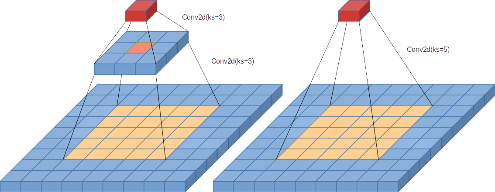
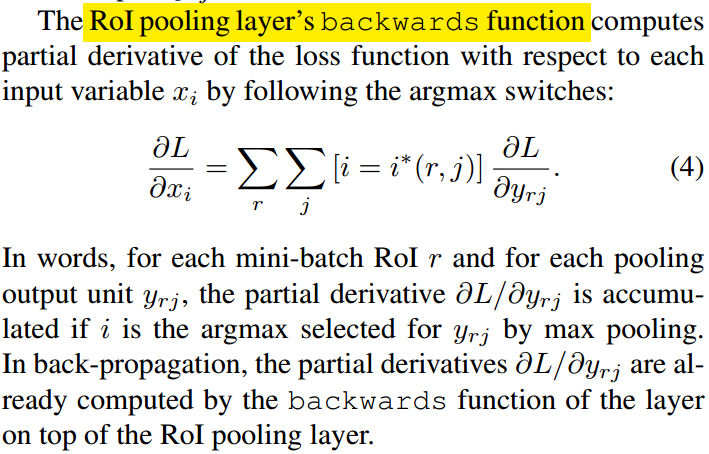
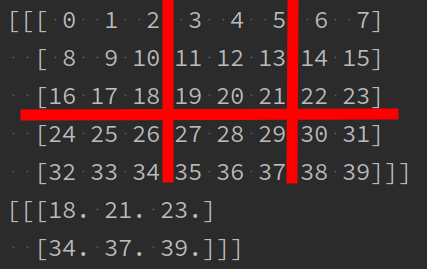
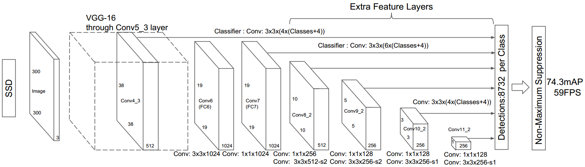
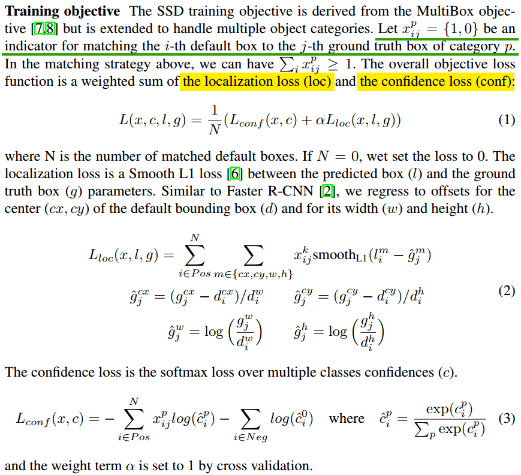

# 术语说明文档

## Convolution(卷积)

卷积的出现使得图像处理进入了新的历史篇章. 极大地提高了参数共享率, 简化了模型, 使得高速处理图像数据成为了可能.

### kernel(卷积核)

卷积核的大小 **kernel_size**

### stride(步长)

步长是指两次卷积运算在一个方向上的间距

### padding(填充)

对输入图像的边缘进行填充

padding_size = kernel_size // 2

### 感受野


两层 ```nn.Conv2d(kernel_size=3)``` 和 ```nn.Conv2d(kernel_size=5)``` 的感受野相同, 但是参数量具有较大差别.

```python
nn.Conv2d(in_ch, out_ch, kernel_size=3)  # 9 * in_ch * out_ch
nn.Conv2d(in_ch, out_ch, kernel_size=3)  # 9 * in_ch * out_ch
```




### **Weight size**

对于输入: in_ch, out_ch, kernel_size

```python
# weight.shape = (in_ch, *kernel_size, out_ch)
size = in_ch * kernel_size.prod() * out_ch
```


## Batch Normal


## RoI

​	在 [**Fast R-CNN**]() 中提出了 **RoI** 层的具体概念及其**反向传播函数**. **RoI** 层的功能就是要解决**卷积层不同尺寸的输出**与**全连接层固定尺寸输入**的连接问题而设计.

​	**卷积层**可以对任意尺寸的数据进行处理, 而**全连接层**的输入尺寸是确定的. 因此, 连接卷积层与全连接层需要进行特殊设计, 一个好的连接结构必须拥有以下三个性质: 

1. **输入**尺寸的**可变性**;
2. **输出**尺寸的**确定性**;
3. 反向传播可计算性.








```python
# 为了更直观的理解 RoI, 未检测数据的安全性及异常处理
import numpy as np

class RoIMaxPooling2d(object):
    def __init__(self, out_size):
        self.w, self.h = out_size  # (w, h)

    def __call__(self, x: np.ndarray):
        (channels, width, height) = x.shape  # (channels, width, height)
        out = np.zeros([channels, self.w, self.h])
        grid_w = (width + self.w - 1) // self.w
        grid_h = (height + self.h - 1) // self.h
        for ch in range(channels):  # channels
            for iw in range(self.w):  # width
                sw, ew = self.update_index(iw, grid_w)
                for ih in range(self.h):  # height
                    sh, eh = self.update_index(ih, grid_h)
                    out[ch, iw, ih] = np.max(x[ch][sw:ew, sh:eh])
        return out

    def backwards(self):
        # TODO: MaxPooling2d 的反向传播函数
        pass

    @staticmethod
    def update_index(idx, grid):
        start = idx * grid
        end = start + grid
        return  start, end

input0 = np.array(range(40)).reshape([1, 5, 8])
input1 = np.random.randn(5, 5, 8)
RoI = RoIMaxPooling2d((2, 3))

output0 = RoI(input0)
output1 = RoI(input1)

print(input0)
print(output0)
print(output1)

print(output0.shape)
print(output1.shape)
```


## IoU

### IoU

**IoU (intersection over union)**: 称为**交并比**, 基础类型的交并比思想来源于**集合**的 **Jaccard (杰卡德) 系数**.


$$
IoU = J(A,B) = \frac {|A \cap B|} {|A \cup B|}
$$

### GIoU


$$
GIoU = IoU - \frac {|\C_{min}| - |A \cup B|} {|\C_{min}|}
$$
其中, $\C_{min}$是 $A,B$ 的最小闭包, 如图1中的虚线框.

### DIoU


$$
DIoU = IoU - \frac {\rho ^2(\hat b, b)} {c^2}
$$
其中, $\hat b, b$ 分别代表了预测框和真实框的中心点, $\rho$ 代表欧氏距离. $c$ 是真实框和预测框的最小闭包 $\C_{min}$ 的对角线的长.

### CIoU


$$
CIoU = IoU - \frac {\rho ^2(\hat b, b)} {c^2}-\alpha v
$$
其中, $v=\frac {4} {\pi ^ 2}(arctan \frac {w^{gt}} {h^{gt}}-arctan \frac {w} {h})$ 用来度量**长宽比**的相似度.

## NMS

非极大值抑制


### SPP

空间金字塔


## **Multi-Scale**







